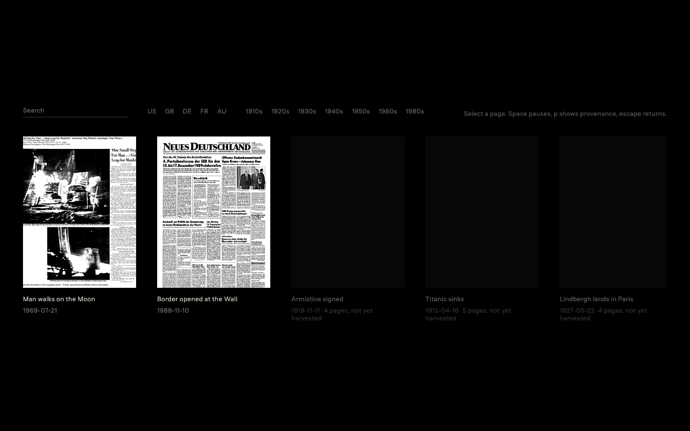

# Atlas History

Atlas History is a cinematic walkthrough of historical front pages. The runnable browser piece is stored in `walkthrough`. The application source handoff is stored separately in `typescript-handoff`.

## Walkthrough

Run `npm run walkthrough` from the repository root, then open `http://localhost:5187/Front%20Pages.dc.html`. The catalogue contains twelve events, with playable Apollo 11 and Berlin Wall sequences backed by the supplied local page and audio assets.

## TypeScript handoff

The `typescript-handoff` folder preserves the React, React Three Fiber, Theatre, audio, data, scenario, shader, overlay and mock Reactor source. Raw source media is intentionally excluded from version control. Remaining asset substitutions are recorded in `walkthrough/PLACEHOLDERS.md`.

## Newspaper previews

Run `npm run fetch:ia` to refresh Internet Archive front page previews for catalogue events without playable scenarios. Use `npm run fetch:ia -- --event titanic1912` to refresh one event. Each successful fetch writes a local page image and a source manifest. A preview does not mark an event playable because a complete scenario and illustration crop are still required.
